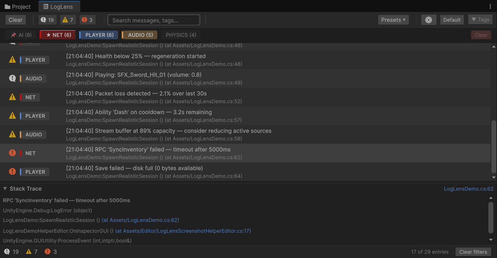
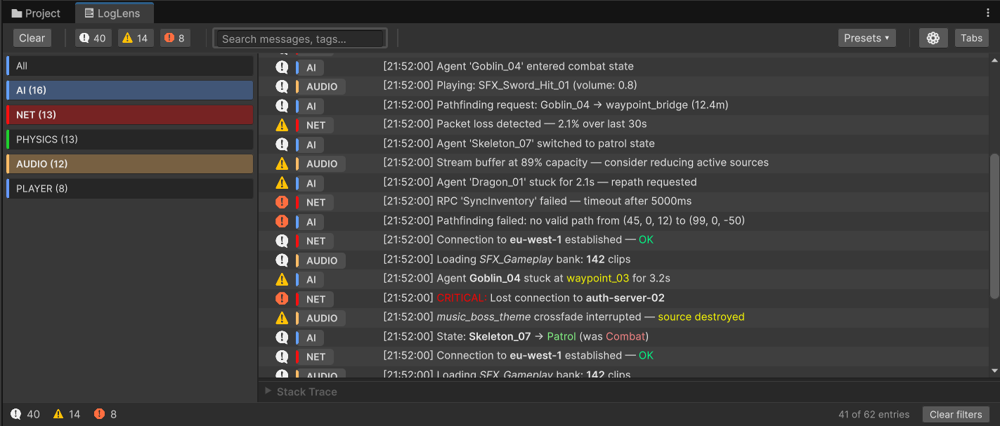
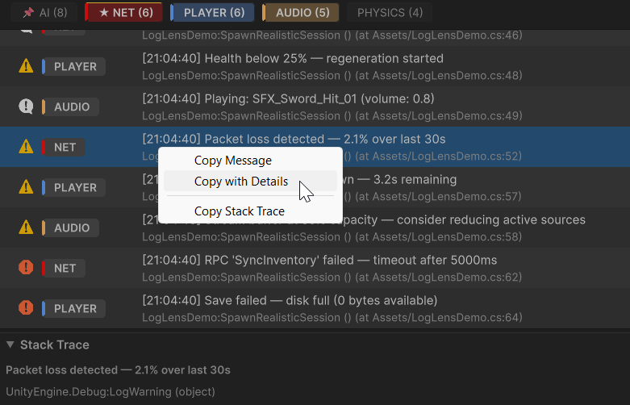
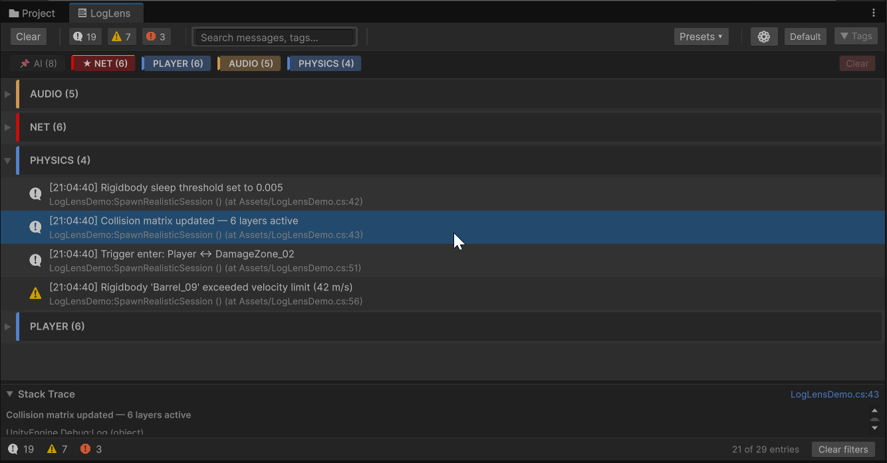
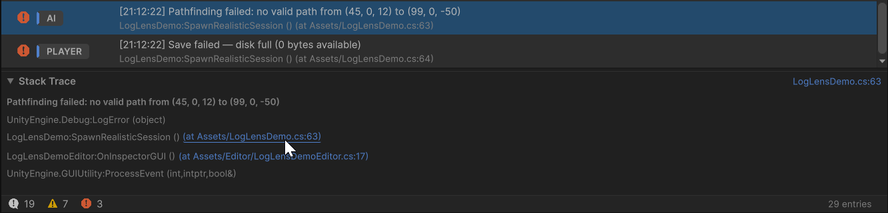
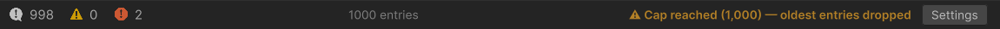

# Editor Window

The LogLens window is a dockable Editor panel that replaces or supplements the Unity Console. Everything you need — filtering, search, tags, stack traces, export — in one place.

---

## Layout

Five regions, top to bottom: **Toolbar**, **Tag Bar**, **Log List**, **Stack Trace Panel**, **Status Bar**. Each is described below.

---

## Toolbar

| Element | What It Does |
|---|---|
| **Clear** | Wipes all log entries (and the Unity Console) |
| **Level toggles** (i / ! / x) | Show or hide Info, Warning, Error+Exception. Badges show counts. Dimmed = hidden. |
| **Search** | Filter by message or tag content. Supports plain text and regex (toggle in Options > Display). 300ms debounce keeps large log sets responsive. Clear with the x button or **Escape**. |
| **Presets** | Save the current filter state, apply a saved preset, or manage (rename/delete) presets. |
| **Gear** | Opens the Options panel (slides in from the right). |

### Responsive Behaviour

When the window is narrow, the toolbar progressively hides non-essential elements to prevent overlap:

| Width | What Hides |
|---|---|
| < 520px | Layout and Tag bar toggles |
| < 420px | Presets button |
| < 340px | Search field |

At the narrowest size, the toolbar shows only: **Clear**, **Level toggles**, and **Gear** button. The window enforces a minimum size of 280 x 150 pixels.

---

## Layout Modes

Toggle between **Default** and **Tabs** with the toolbar button.

| Mode | Description |
|---|---|
| **Default** | Tag bar above the log list — click chips to filter by tag |
| **Tabs** | Side panel on the left lists all tags. Tag bar is hidden. |

### Tabs Mode

The left panel shows **All**, **Untagged** (if any), then each tag with its entry count.

- **Click** a tag to single-select — only that tag's entries are shown
- **Ctrl+Click** (Cmd+Click on macOS) to multi-select — toggle tags on and off
- Removing the last selected tag falls back to **All**
- **Right-click** a tag for color and settings options

---

## Tag Bar

A row of colored chips — one per tag detected in your logs, with entry counts.

- **Click** a chip to filter to that tag. Click again to deselect.
- **Select multiple** chips to show entries matching any of them.
- **Right-click** a chip for: Pin, Always Show, Change Color, Open Project Settings.
- **Clear** button resets the tag filter.

Pinned tags stick to the left. Always-visible tags (set in Project Settings) bypass the tag filter entirely — they always show, regardless of selection.

See [Tag System](Tag-System.md) for full details on tag resolution, colors, and configuration.

---

## Log List

Each row shows: level icon, tag badge, message, and (optionally) timestamp.

Long messages extend beyond the visible area — a **horizontal scrollbar** appears automatically so you can scroll to read the full text. Hovering any row also shows the full message as a tooltip.

### Display Modes

| Mode | Description |
|---|---|
| **Compact** | Single line per entry, tighter rows. Toggle in Options > Display. |
| **Expanded** | Message + first useful stack frame line (default). |

### Grouping (Options > View)

| Mode | Result |
|---|---|
| **Flat** | One continuous list — no headers. |
| **By Tag** | Collapsible group per tag. Tag column hidden. |
| **By Frame** | Collapsible group per `Time.frameCount`. Tag column hidden. |

### Collapse Identical (Flat mode only)

Consecutive identical messages merge into a single row with a count badge. Choose whether to display the **first** or **last** occurrence in Options > View.

### Interactions

| Action | Result |
|---|---|
| **Click** a row | Select it; stack trace panel updates |
| **Double-click** a row | Jump to source in your IDE |
| **F4** | Jump to source for the selected row |
| **Right-click** | Copy Message, Copy with Details, Copy Stack Trace |

---

## Stack Trace Panel

Select a log entry to see its stack trace. The first line shows the **log message** in bold, followed by the stack frames.

- **Clickable links** — `(at File.cs:42)` references open your IDE at that line.
- **Jump button** in the header shows `filename:line` for the most relevant frame.
- **Collapse/expand** with the arrow, or press **Enter** with a row selected.
- **Resize** by dragging the gripper above the panel.

---

## Status Bar

The bottom strip shows at a glance:

| Element | Description |
|---|---|
| **Level counts** | Icon + number for Info, Warning, Error |
| **Entry count** | `N entries` — or `N of M entries` when filters are active |
| **Cap warning** | Appears when the log buffer hits MaxEntryCap, with a shortcut to Settings |
| **Clear filters** | One-click reset of all active filters |

---

## Options Panel

Click the **gear** button to slide open the Options panel from the right. Four tabs:

| Tab | Controls |
|---|---|
| **View** | Grouping, Collapse identical, Show first/last, Accordion groups |
| **Display** | Timestamp, Compact mode, Strip tags, Rich text, Tag position, Sort tags by count, Regex search |
| **Behaviour** | Clear on play, Auto-scroll, Persist across domain reload, Show on startup (overlay), Auto-show on error |
| **Export** | Ignore filters, Flatten, Include stack trace, Format (.txt / .csv), Export button with count preview |

The panel header has a gear icon (opens Project Settings > LogLens) and a close button. Press **Escape** or click the backdrop to dismiss.

Full setting descriptions in [Settings](Settings.md).

---

## Keyboard Shortcuts

| Shortcut | Action |
|---|---|
| **Ctrl+F** | Focus search field |
| **Escape** | Close Options / clear search |
| **Ctrl+C** | Copy selected message |
| **Ctrl+Shift+C** | Copy with details (timestamp, level, tag, stack) |
| **F4** | Jump to source |
| **F5** / **Ctrl+R** | Force refresh |
| **Enter** | Toggle stack trace panel |
| **Home** / **End** | Jump to first / last entry |

Full list in [Keyboard Shortcuts](Keyboard-Shortcuts.md).
