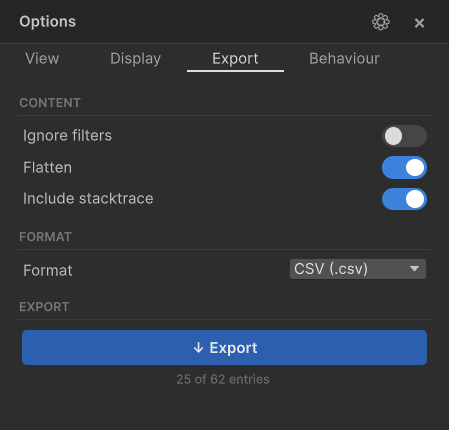

# Export

Export your logs to `.txt` or `.csv` — from the Editor or from the runtime overlay on device. Active filters are respected by default, so you export exactly what you see.



---

## Export from the Editor

1. Open the **Options panel** (gear button) and switch to the **Export** tab
2. Configure your options (see below)
3. Click **Export**
4. Choose a save location in the file dialog

Default filename: `LogLens_yyyy-MM-dd_HH-mm-ss`

---

## Export from the Overlay

On device or in Play mode, type `export` in the overlay command bar. Logs are written to `Application.persistentDataPath` with a timestamped filename. The path is displayed in the overlay status bar.

From code:

```csharp
LogLensOverlay.Instance?.ExportLogs();
```

---

## Export Options

| Option | Description |
|---|---|
| **Ignore filters** | Export all entries regardless of active level, tag, and search filters |
| **Flatten** | Output as a flat list even when grouping is By Tag or By Frame — no section headers |
| **Include stacktrace** | Append the stack trace below each entry |
| **Format** | `.txt` (human-readable) or `.csv` (spreadsheet/tool-friendly) |

The Export button shows a live count preview: **"Export 42 entries"** (or **"Export 42 of 120 entries"** when filters are active and Ignore filters is off).

---

## Output Formats

### Text (.txt)

```
[14:23:01.456] INFO   [NET]   Socket connected
[14:23:01.891] WARN   [AUDIO] Clip not found: footsteps
[14:23:02.456] ERROR          NullReferenceException in PlayerController
    at PlayerController.Update () (at Assets/Scripts/PlayerController.cs:42)

--- NET (12) ---
[14:23:01.456] INFO   [NET]   Socket connected
...
```

When grouped (By Tag or By Frame) and Flatten is off, section headers like `--- NET (12) ---` separate each group.

### CSV (.csv)

```
sep=,
Timestamp,Level,Tag,Frame,Message,StackTrace
"14:23:01.456",Log,"NET",142,"Socket connected",""
"14:23:01.891",Warning,"AUDIO",142,"Clip not found: footsteps",""
"14:23:02.456",Error,"",143,"NullReferenceException in PlayerController","at PlayerController..."
```

- First line is `sep=,` — a hint that tells Excel which delimiter to use
- Header row + one row per entry
- All fields are quoted to ensure correct parsing in Excel and other spreadsheet tools
- Columns: Timestamp, Level, Tag, Frame, Message, StackTrace

---

## Timestamp and Encoding

Configure in **Project Settings > LogLens > Logs**:

| Setting | Options | Default |
|---|---|---|
| **Timestamp Format** | Any valid .NET format string (e.g. `HH:mm:ss.fff`, `yyyy-MM-dd HH:mm:ss.fff`). Invalid formats show a warning and auto-revert. | `HH:mm:ss.fff` |
| **Encoding** | UTF-8, UTF-16 (Unicode) | UTF-8 |
