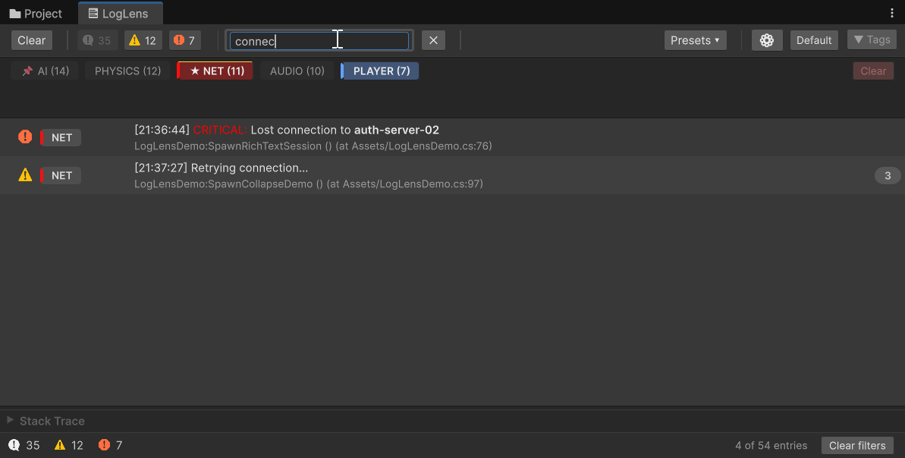
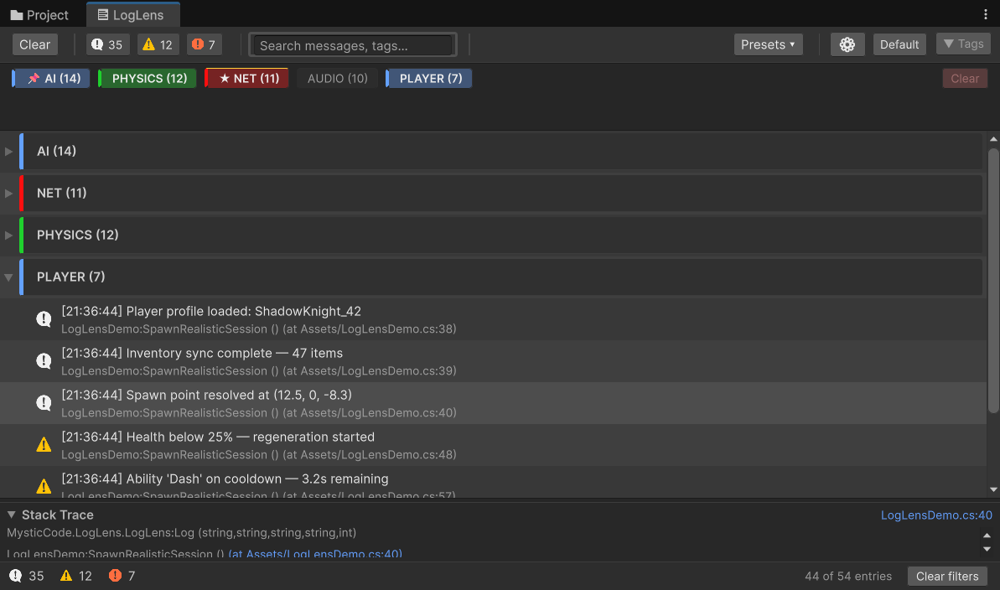
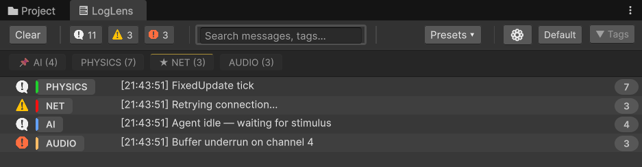
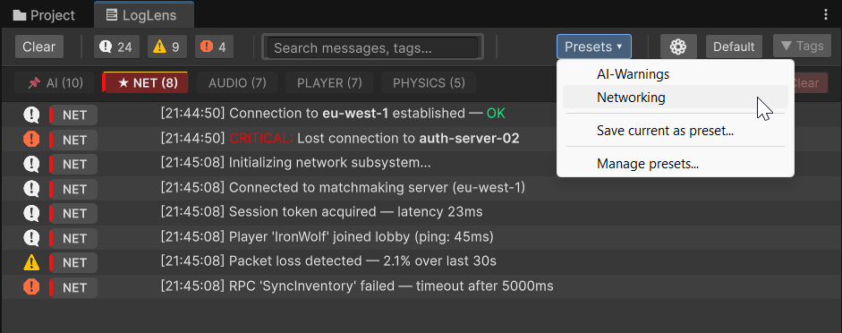

# Filtering

LogLens gives you three independent filters — level, tag, and search — that combine to cut through any volume of logs instantly. Save the entire filter state as a preset and switch contexts in one click.



---

## Level Toggles

Three buttons in the toolbar control log level visibility:

| Toggle | Levels Included |
|---|---|
| **Info** (i) | `LogType.Log` |
| **Warning** (!) | `LogType.Warning` |
| **Error** (x) | `LogType.Error` and `LogType.Exception` |

Click to show or hide. Each badge shows the total count for that level. When off, the icon dims and matching entries disappear from the list.

All three filters are independent — turn off Info and Warning to see only errors, or hide errors to focus on warnings during a specific investigation.

---

## Search

The search field filters by **message text** and **tag name** simultaneously.

| Mode | Behaviour |
|---|---|
| **Plain text** (default) | Case-insensitive substring match |
| **Regex** | Full regex matching — enable in Options > Display > Regex search |

- **300ms debounce** keeps the UI responsive with large log sets
- **Clear** with the x button, or press **Escape** while the search field is focused
- **Ctrl+F** focuses the search field from anywhere in the window

Search combines with level toggles and tag selection — only entries passing all three filters are shown.

---

## Tag Filter

Click a tag chip in the tag bar to filter by that tag. Click again to deselect.

- **Multi-select** — Select multiple chips to show entries matching **any** of the selected tags
- **Clear** button in the tag bar resets the tag filter
- **Always-visible tags** (configured in Project Settings) bypass the tag filter — their entries always show regardless of selection

In **Tabs** layout mode, tags appear as a side panel instead of chips. Click to single-select; **Ctrl+Click** (Cmd+Click on macOS) to multi-select tags. Removing the last selected tag falls back to "All".

Tag filtering works with all other filters. Select `NET`, turn off Info, search for "timeout" — and you see exactly the network error timeouts.

---

## Grouping

Change how logs are organised in **Options > View > Grouping**:

| Mode | What You See |
|---|---|
| **Flat** | A single chronological list — no headers, no nesting |
| **By Tag** | Collapsible groups, one per tag. Untagged entries get their own group. |
| **By Frame** | Collapsible groups, one per `Time.frameCount`. See everything that happened in a single frame. |

In grouped modes, the tag column is hidden (the group header already shows the tag or frame).



### Accordion Mode

In grouped modes, enable **Accordion groups** (Options > View) to auto-collapse other groups when you expand one. Only one group is open at a time — useful when you're drilling into a specific tag or frame.

---

## Collapse Identical

**Options > View > Collapse identical** (available in Flat mode only)

When consecutive identical messages (same level + same text) appear, they merge into a single row with a **count badge** showing how many were collapsed.

| Option | Effect |
|---|---|
| **Collapse identical** | Toggle the feature on/off |
| **Show first (not last)** | Display the first occurrence instead of the last |

This is particularly useful for repeated warnings or frame-rate log spam — instead of 200 identical lines, you see one line with "x200".



---

## Filter Presets

Save your entire filter state — levels, selected tags, search text, grouping mode — as a **named preset**. Restore it in one click.

### Workflow

1. Set up your filters the way you want them
2. **Presets > Save current...** — enter a name
3. The preset appears in the Presets dropdown
4. **Presets > [preset name]** — apply it instantly
5. **Presets > Manage...** — rename or delete saved presets



Presets persist across sessions and domain reloads. Use them for recurring workflows:

- **"Errors only"** — All errors, no info/warning, no tag filter
- **"Network debug"** — NET tag selected, search empty, all levels
- **"Frame analysis"** — Grouped by frame, all levels, no search
- **"QA report"** — Errors + warnings, grouped by tag

---

## Status Bar Feedback

The status bar at the bottom of the window reflects your current filter state:

| Element | When It Appears |
|---|---|
| **N entries** | No filters active — showing everything |
| **N of M entries** | Filters active — showing N out of M total |
| **Clear filters** | Any filter is active — click to reset all filters at once |
| **Cap warning** | Log buffer has hit MaxEntryCap — oldest entries are being dropped. Click for Settings. |

---

## Filter Interaction Summary

All filters combine with AND logic:

```
Visible = (level passes) AND (tag passes OR tag is always-visible) AND (search matches)
```

This means turning off Info, selecting the NET tag, and searching "timeout" shows only Warning/Error entries tagged NET that contain "timeout" in their message or tag.
