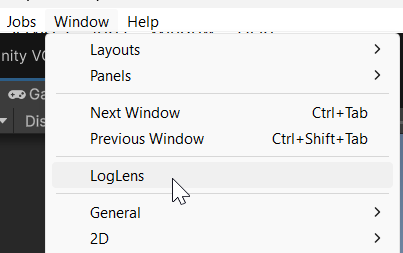
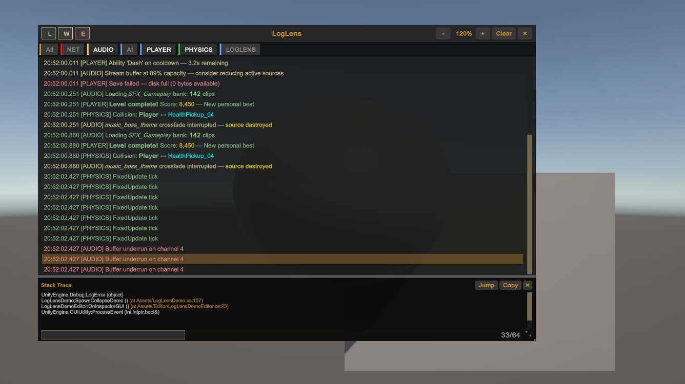

# Getting Started

From import to first log in under 60 seconds. No configuration, no scene setup, no prefabs.

---

## Install

Add LogLens to your project through the Unity Package Manager — either from a `.unitypackage`, a local folder, or a scoped registry. Wait for compilation to finish. That's it.

## Open the Window

**Window > LogLens**

The LogLens window opens as a dockable panel. Place it wherever suits your layout — next to the Console, below the Game view, or on a second monitor.



## See Your Logs

Run your game. Every `Debug.Log`, `Debug.LogWarning`, `Debug.LogError`, and `LogLens.Log` call appears in the LogLens window — live, as they happen.

## Tag Without Changing Code

Already using bracket prefixes like `Debug.Log("[NET] timeout")`? LogLens detects them automatically. The tag `NET` appears as a colored chip in the tag bar, ready to filter.

```csharp
// These all work out of the box — no LogLens API needed
Debug.Log("[NET] Socket connected");
Debug.LogWarning("[AUDIO] Clip not found: footsteps");
Debug.LogError("[AI] Pathfinding failed on NavMesh");
```

No bracket prefix? No problem — tags are optional. Untagged logs show up just fine.

## Use the LogLens API

For richer features like jump-to-source, type-based tags, and compile-time stripping, use the LogLens API:

```csharp
using MysticCode.LogLens;

// Simple logging — jump-to-source works automatically
LogLens.Log("Player spawned");

// Explicit tag
LogLens.Log("Socket connected", "NET");

// Type-based tag via [LensLogTag] attribute
LogLens.Log<NetworkManager>("Handshake complete");
```

All `LogLens.Log` calls are stripped in release builds automatically — zero overhead.

## Show the Overlay

Enter Play mode (or run a build) and press **F2**. The runtime overlay appears over your game — a draggable, resizable log panel with its own level and tag filters.



On mobile or console, call `LogLensOverlay.Instance?.Toggle()` from a gesture or debug menu.

## What to Explore Next

| Want to... | Go to |
|---|---|
| Learn the Editor window layout | [Editor Window](Editor-Window.md) |
| Organise logs with tags | [Tag System](Tag-System.md) |
| Search, filter, save presets | [Filtering](Filtering.md) |
| Use the on-device overlay | [Runtime Overlay](Overlay.md) |
| Export logs to file | [Export](Export.md) |
| Call LogLens from code | [API Reference](API-Reference.md) |
| Strip LogLens from production | [API Reference > Build Stripping](API-Reference.md#build-stripping) |
