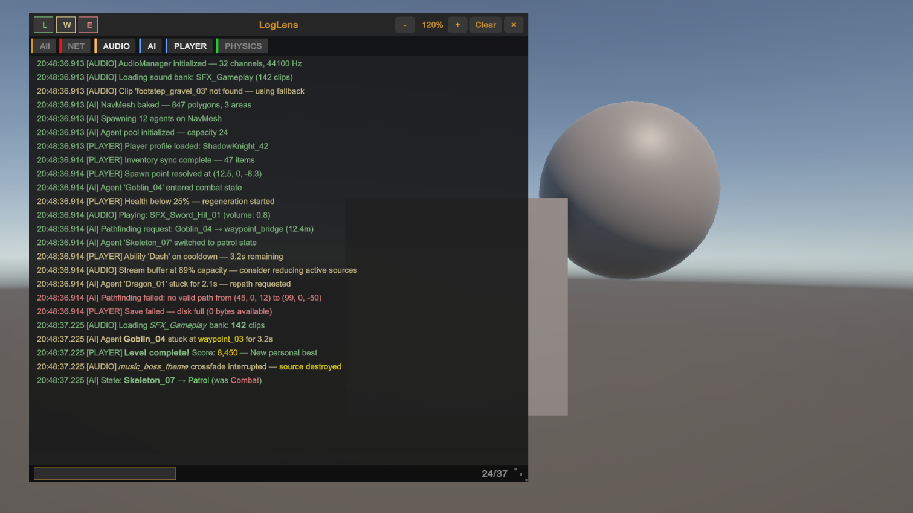
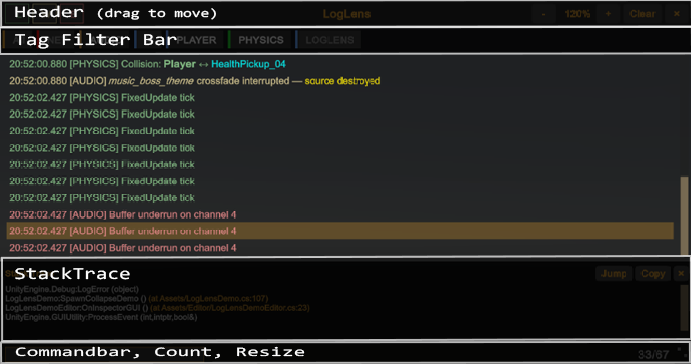
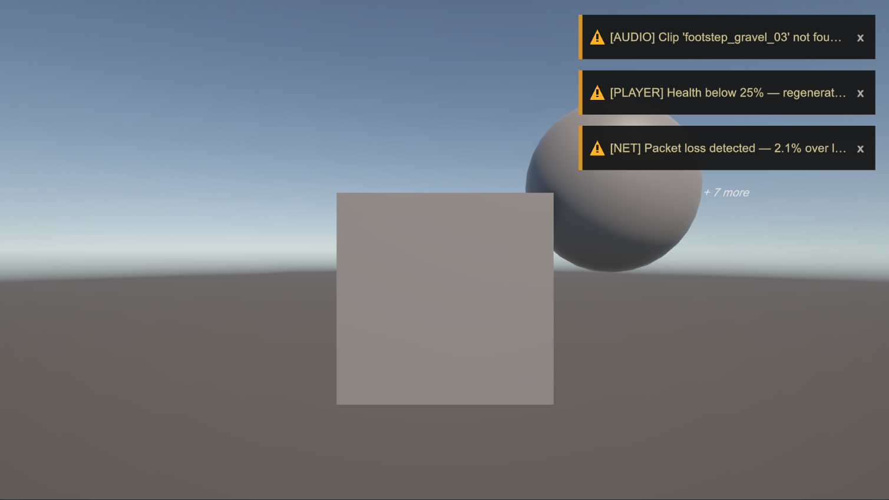
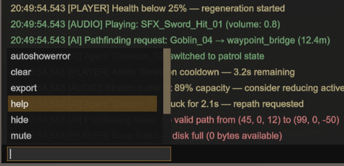

# Runtime Overlay

> **The feature that makes LogLens different.** A full log console rendered over your game — on every platform, with zero setup.

Unity's console is Editor-only. The moment you test on device — phone, tablet, console, standalone build — you lose log visibility. LogLens fixes that.

Import the package. Press **F2**. Logs render on screen. No prefabs, no GameObjects, no scene setup, no Input System, no render pipeline dependency. It just works.



---

## Zero Setup

- **Self-installs** via `[RuntimeInitializeOnLoadMethod(AfterSceneLoad)]` — no MonoBehaviour to add
- **Runs everywhere** — uses OnGUI, which is available on all platforms Unity supports
- **No dependencies** — no Input System, no TextMeshPro, no render pipeline hooks
- **Strips cleanly** — disable in Project Settings and all overlay code is removed from builds

---

## Toggle Visibility

| Method | How |
|---|---|
| **Keyboard** | Press **F2** (configurable in Project Settings > LogLens > Overlay > Toggle Key) |
| **Code** | `LogLensOverlay.Instance?.Toggle()` |
| **Auto-show** | Enable "Auto Show on Error" in Project Settings — overlay appears on any error or exception |

The overlay always installs (unless stripped via `LOGLENS_DISABLE`), but starts **hidden** by default. Enable **Show on Startup** in Project Settings to make it visible immediately on launch.

On mobile and console where keyboard input isn't available, wire `Show()` / `Hide()` / `Toggle()` to your debug menu, a gesture, or a button combo.

---

## Layout




---

## Interactions

| Action | Result |
|---|---|
| **Drag the header** | Reposition the overlay anywhere on screen. Position is persisted via PlayerPrefs. |
| **Drag the resize grip** | Resize from the bottom-right corner |
| **Level toggles** (L/W/E/!) | Filter by Log, Warning, Error, Exception |
| **Tag chips** | Filter by tag — multi-select supported |
| **Click a row** | Select it and show its stack trace |
| **Clear** | Clear the log buffer (also clears the Unity Console) |
| **Zoom** (- / +) | Scale from 50% to 300% |
| **Close** (x) | Hide the overlay |

---

## Toast Notifications

Lightweight slide-in notifications that appear when warnings or errors are logged — without opening the full overlay. Toasts render independently of overlay visibility, so you get notified even when the overlay is hidden.

Each toast shows a level icon (triangle for warnings, circle for errors), the log message, and a close button. Toasts slide in, stay visible for a configurable duration, then slide out.

| Behaviour | Description |
|---|---|
| **Click a toast** | Opens the overlay and selects the corresponding log entry |
| **Click x** | Dismiss the toast immediately |
| **Overflow** | When more toasts arrive than `Max Visible`, an overflow count badge appears |
| **Custom toasts** | Call `ShowToast("message")` from code — not linked to any log entry |
| **Mute** | Type `mute` in the command bar to silence toasts for the session |

Configure toasts in **Project Settings > LogLens > Overlay > Toasts** — enable/disable, position, max visible, duration, zoom. See [Settings](Settings.md#overlay) for all options.



---

## Command Bar

The status bar at the bottom doubles as a command input. Type a command and press **Enter**.

Autocomplete appears as you type — use **Tab** or **Arrow keys** to navigate suggestions, **Enter** to execute. The popup scrolls when there are more commands than fit.



### Built-In Commands

| Command | Action |
|---|---|
| `help` | List all available commands |
| `clear` | Clear all log entries |
| `hide` | Hide the overlay |
| `export` | Export visible logs to `Application.persistentDataPath` |
| `zoom <50-300>` | Set zoom level (e.g. `zoom 150` for 150%) |
| `toast <message>` | Show a custom toast notification |
| `toastzoom <50-300>` | Set toast zoom level independently from overlay |
| `mute` | Toggle toast mute on/off (session only) |
| `autoshowerror` | Toggle auto-show overlay on error |

### Custom Commands

Register your own commands from anywhere in your code:

```csharp
// Simple command
LogLensCommands.RegisterCommand(
    "reload",
    () => SceneManager.LoadScene(SceneManager.GetActiveScene().buildIndex),
    "Reload the current scene"
);

// Command with arguments
LogLensCommands.RegisterCommand(
    "tag",
    args => {
        if (args.Length > 0)
            LogLensOverlay.Instance?.SetTagFilter(args[0]);
    },
    "Filter overlay by tag",
    "tag <name>"
);

// Unregister when no longer needed
LogLensCommands.UnregisterCommand("reload");
```

Custom commands appear in autocomplete and in the `help` output.

---

## Keyboard Shortcuts

| Shortcut | Action |
|---|---|
| **F2** (configurable) | Toggle overlay visibility |
| **Ctrl+=** / **Ctrl+NumPad+** | Zoom in |
| **Ctrl+-** / **Ctrl+NumPad-** | Zoom out |
| **Ctrl+0** | Reset zoom to default |

### Command Bar Keys

| Key | Action |
|---|---|
| **Tab** / **Down** | Next autocomplete suggestion |
| **Up** | Previous suggestion |
| **Enter** | Execute command |
| **Escape** | Clear field and dismiss autocomplete |

---

## Public API

Every overlay behaviour is controllable from code — essential for mobile and console where keyboard input isn't available.

```csharp
var o = LogLensOverlay.Instance;
if (o == null) return; // Overlay disabled or not yet installed

// Visibility
o.Show();
o.Hide();
o.Toggle();

// Zoom (50-300%)
o.ZoomIn();
o.ZoomOut();
o.SetZoom(1.5f);    // 150%
o.ResetZoom();       // Back to project default

// Level filter
o.SetLevelFilter(log: true, warning: true, error: true);

// Tag filter
o.SetTagFilter("NET");    // Toggle a tag; pass null to clear all
o.ClearTagFilter();

// Logs
o.ClearLogs();
o.ResumeAutoScroll();     // When user has scrolled up

// Position and size
o.SetPosition(20f, 20f);
o.SetSize(600f, 400f);
o.ResetPositionAndSize(); // Clear PlayerPrefs, use defaults

// Export
o.ExportLogs();           // Writes to persistentDataPath

// Toasts
o.ShowToast("Build done!", Color.green);  // Custom toast
o.MuteToasts(true);       // Silence toasts for this session
o.MuteToasts(false);      // Un-mute
bool muted = o.ToastsMuted;
```

### Common Patterns

**Mobile debug gesture — 4-finger tap to toggle:**

```csharp
void Update()
{
    if (Input.touchCount == 4)
        LogLensOverlay.Instance?.Toggle();
}
```

**Auto-export on crash:**

```csharp
Application.logMessageReceived += (msg, stack, type) =>
{
    if (type == LogType.Exception)
        LogLensOverlay.Instance?.ExportLogs();
};
```

---

## Stripping from Production

When you're ready to ship:

1. **Project Settings > LogLens > Overlay** — uncheck **Enable Overlay**
2. This adds `LOGLENS_DISABLE` to your Scripting Define Symbols
3. All overlay code is stripped from the build
4. `LogLensOverlay` compiles as a no-op stub — existing references won't break

Combined with omitting `LOGLENS_ENABLED` (which strips `LogLens.Log` calls), you get **zero LogLens code in your release build**.

---

## Platform Notes

| Platform | Toggle Method | Notes |
|---|---|---|
| **PC / Mac (Editor)** | F2 or API | Full support |
| **PC / Mac (Build)** | F2 or API | Full support |
| **iOS / Android** | API only | Wire to tap gesture, shake, or debug menu |
| **Console** | API only | Wire to button combo in debug menu |

The overlay uses IMGUI `Event.current` for input — no Input System dependency. Keyboard shortcuts work in Editor and standalone builds. On mobile and console, use the [public API](#public-api) instead.
