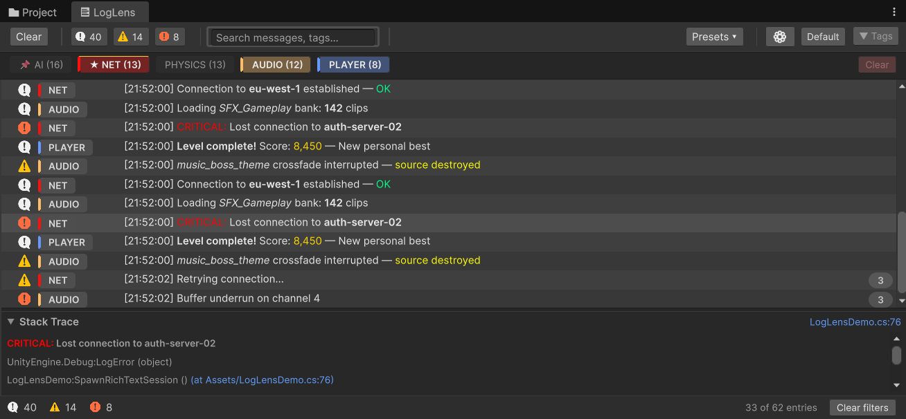
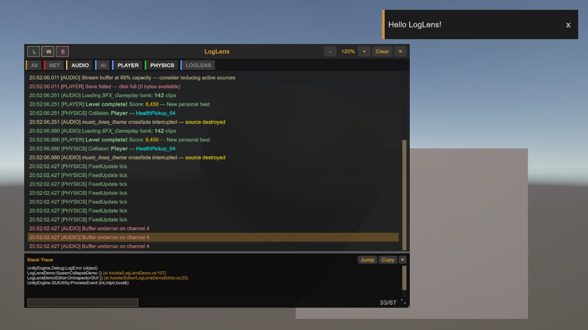

# LogLens — Enhanced Debug Console for Unity

> **See your logs everywhere.** Editor, device, build — one tool, zero setup.

LogLens is a modern, Unity 6-native debug console that goes where Unity's built-in console can't. Powerful tag-based filtering, instant search, export — and a **runtime overlay** that renders logs directly on-screen in any build, on any platform, with nothing to configure.



---

## The Problem

Unity's console disappears the moment you leave the Editor. Test on a phone, deploy to a console, hand a build to QA — and you're flying blind. Bugs happen on device, not in the Editor. You need logs where the bugs are.

## The Solution

**LogLens puts a full-featured debug console on every screen.**

Import the package. Open **Window > LogLens**. Press **F2** in Play mode or any build — logs render over your game. No prefabs. No scene objects. No Input System. No render pipeline hooks. It just works.

---

## At a Glance

| | Built-in Console | LogLens |
|---|---|---|
| **Where** | Editor only | Editor **+ on-device overlay** |
| **Filtering** | Type toggles | Tags, regex search, level toggles, **saved presets** |
| **Organisation** | Flat list | Group by tag, group by frame, **collapse duplicates** |
| **Export** | None | `.txt` and `.csv`, filters preserved |
| **Production cost** | Stays in build | **Zero-cost compile-time stripping** |
| **Setup** | Built-in | **Zero setup** — import and go |

---

## Key Features

### Runtime Overlay — Logs Where the Bugs Are

The headline feature. A draggable, resizable, zoomable log panel that renders over your game on **every platform** — Editor, standalone, iOS, Android, console. Toggle with F2 or from code. Filter by level and tag. Run commands. Export on device. Strip from production with one checkbox. **Toast notifications** slide in for warnings and errors even when the overlay is hidden — click a toast to jump to the entry.

[Runtime Overlay docs >>>](Overlay.md)



### Tag-Based Organisation

Stop scrolling through walls of text. Tag your logs — use `[TAG]` prefixes in existing `Debug.Log` calls, apply `[LensLogTag]` attributes to classes, or define regex extraction rules. Tags appear as colored, filterable chips. Pin important ones. Mark system-critical tags as always-visible so they can never be filtered out.

[Tag System docs >>>](Tag-System.md)

### Instant Search and Filter Presets

Type to search across messages and tags — plain text or regex, with 300ms debounce for large log sets. Combine with level toggles and tag selection. Save the entire filter state as a **named preset** and restore it in one click. Switch contexts without losing your setup.

[Filtering docs >>>](Filtering.md)

### Export — Share What Matters

Export the current view to `.txt` or `.csv`. Active filters are respected by default, so you export exactly what you see — or toggle "Ignore filters" to grab everything. Timestamps, encoding, and stack trace inclusion are all configurable.

[Export docs >>>](Export.md)

### Zero-Cost Production Stripping

LogLens API calls (`LogLens.Log`, `Warning`, `Error`, `Exception`) use `[Conditional]` attributes — omit `LOGLENS_ENABLED` from release builds and every call is erased at compile time. Disable the overlay in Project Settings and `LOGLENS_DISABLE` strips it entirely. **Zero runtime cost when you ship.**

### Built for Unity 6

UIToolkit throughout. Dark and light theme support. Responsive toolbar that adapts to narrow windows. Resizable panels. Clickable `file:line` links in stack traces that open your IDE.

---

## Quick Start

```
1.  Import LogLens via Package Manager
2.  Open  Window > LogLens
3.  Run your game — logs appear immediately
4.  Press F2 to show the on-screen overlay
```

Existing `Debug.Log("[NET] message")` calls are automatically tagged. No code changes required.

---

## Documentation

| Document | What's Inside |
|---|---|
| [Getting Started](Getting-Started.md) | Install, open, first logs in 60 seconds |
| [Editor Window](Editor-Window.md) | Toolbar, log list, stack trace, layout modes |
| [Tag System](Tag-System.md) | Tag resolution, `[LensLogTag]`, regex rules, colors |
| [Filtering](Filtering.md) | Search, level toggles, tag filter, presets |
| [Runtime Overlay](Overlay.md) | On-device overlay, commands, API |
| [Export](Export.md) | Formats, options, overlay export |
| [Settings](Settings.md) | Project Settings and Options panel |
| [API Reference](API-Reference.md) | `LogLens`, `LogLensOverlay`, `LogLensCommands` |
| [Keyboard Shortcuts](Keyboard-Shortcuts.md) | Every shortcut, Editor and overlay |

---

## Requirements

- **Unity 6000.0** or newer
- No additional packages required

---

## Package Info

| | |
|---|---|
| **Package name** | `com.mysticcode.loglens` |
| **Version** | 1.0.0 |
| **Namespace** | `MysticCode.LogLens` |
