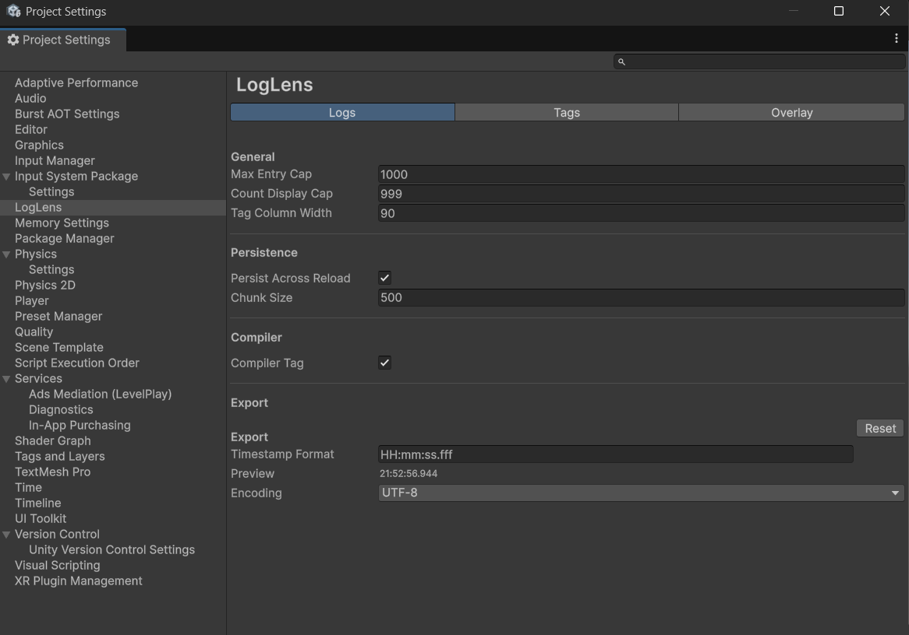
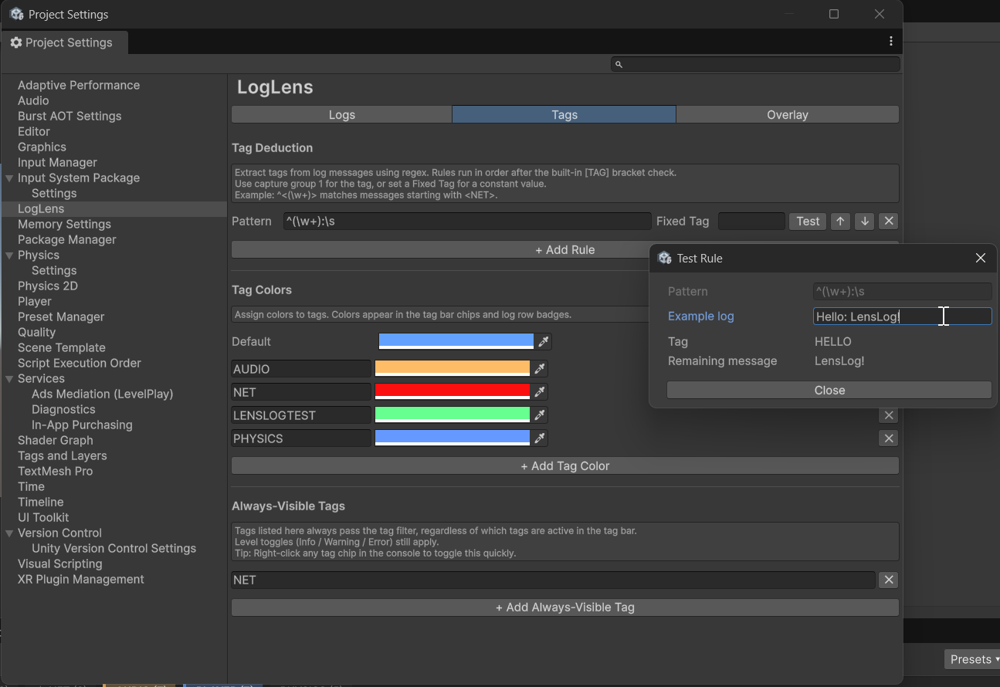
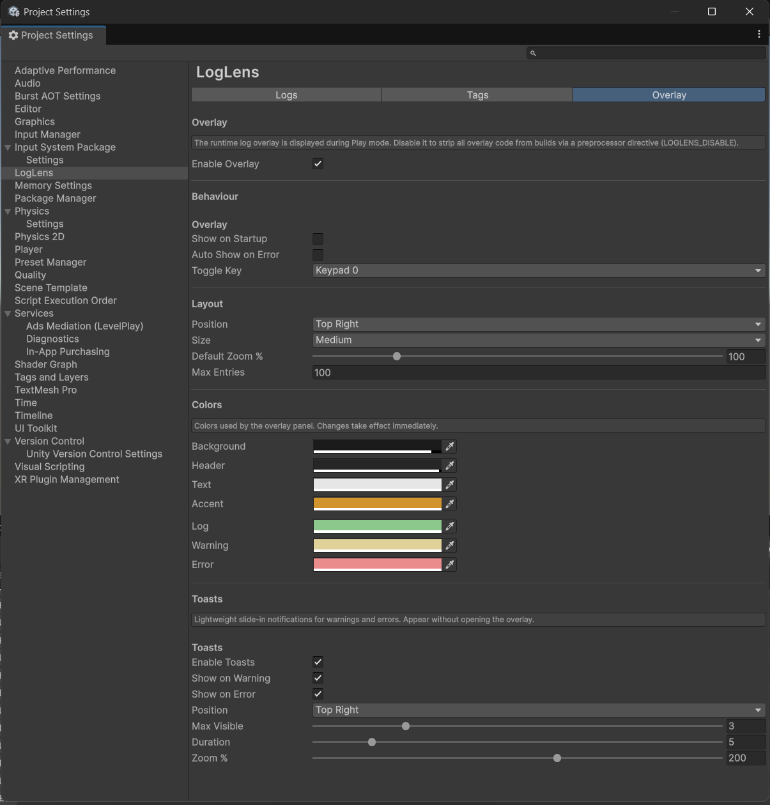
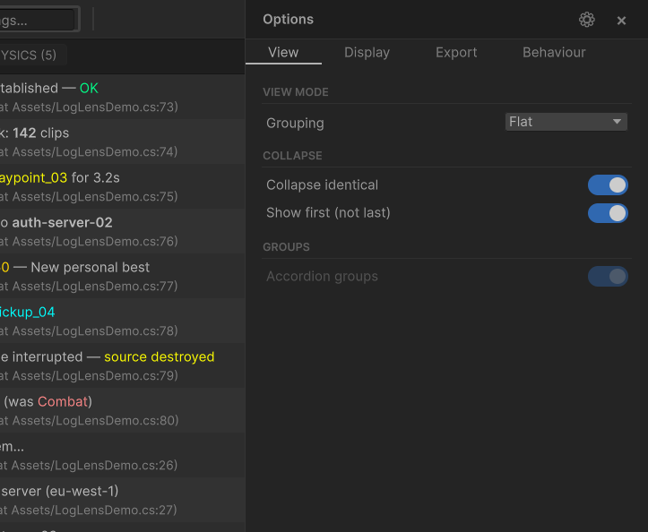

# Settings

LogLens settings live in two places: **Project Settings** (shared per-project, version-controlled) and the **Options panel** (per-user preferences, stored locally).

---

## Project Settings

**Edit > Project Settings > LogLens**

Three tabs: **Logs**, **Tags**, **Overlay**.

### Logs

| Setting | Description | Default |
|---|---|---|
| **Max Entry Cap** | Maximum log entries held in memory. Oldest entries are dropped when the cap is reached. | 10000 |
| **Count Display Cap** | Counts above this display as "N+" (e.g. 999+). Set to 0 for no cap. | 9999 |
| **Tag Column Width** | Width of the tag badge column in the log list (60-200 px). | 90 |

**Compiler**

| Setting | Description |
|---|---|
| **Compiler Tag Enabled** | Auto-tag C# compiler errors/warnings as `COMPILER`. These entries survive Clear and are only removed on successful recompilation. Disable to turn off compiler tagging. (Default: on) |

**Persistence**

| Setting | Description |
|---|---|
| **Persist Across Reload** | Keep logs across script recompilation and domain reload |
| **Chunk Size** | Entries per persistence chunk (100-2000). Larger chunks = fewer file writes, more memory per chunk. |

**Export**

| Setting | Description |
|---|---|
| **Timestamp Format** | Format string for timestamps in exported files (e.g. `HH:mm:ss.fff`, `yyyy-MM-dd HH:mm:ss.fff`). Invalid formats show a warning and auto-revert to the default. |
| **Encoding** | UTF-8 or UTF-16 (Unicode) for exported files |

---

### Tags

| Setting | Description |
|---|---|
| **Tag Deduction** | Regex rules to extract tags from log messages. Rules run in list order after the built-in `[TAG]` bracket check. Use capture group 1 for dynamic extraction, or set a Fixed Tag. Each rule has a Test button. |
| **Tag Colors** | Per-tag color assignments. A default color applies to tags without a specific assignment. Colors appear on chips and row badges. |
| **Always-Visible Tags** | Tags that bypass the tag filter entirely. Entries with these tags are always shown regardless of tag selection. Level toggles still apply. |

---

### Overlay

| Setting | Description |
|---|---|
| **Enable Overlay** | Master toggle. When off, adds `LOGLENS_DISABLE` to Scripting Define Symbols and strips all overlay code from builds. |

When enabled, the following settings appear:

**Behaviour**

| Setting | Description |
|---|---|
| **Show on Startup** | Start the overlay visible when entering Play mode (editor) or launching a build. When off, use the toggle key or API to show it. (Default: off) |
| **Auto Show on Error** | Automatically show the overlay when an error or exception is logged |
| **Toggle Key** | Keyboard key to toggle visibility (default: F2) |

**Layout**

| Setting | Description |
|---|---|
| **Position** | Initial screen corner for the overlay |
| **Size** | Preset size: Small (20%), Medium (35%), or Large (50%) of screen |
| **Default Zoom %** | Initial zoom level (50-300%) |
| **Max Entries** | Maximum entries visible in the overlay (10-500) |

**Colors**

| Setting | Description |
|---|---|
| **Background** | Overlay background color |
| **Header** | Header bar color |
| **Text** | Default text color |
| **Accent** | Accent color for title, tag chips, and selection highlight |
| **Log / Warning / Error** | Per-level text colors |

**Toasts**

| Setting | Description | Default |
|---|---|---|
| **Enable Toasts** | Show lightweight slide-in notifications for warnings and errors without opening the overlay. | on |
| **Show on Warning** | Show a toast when a warning is logged | on |
| **Show on Error** | Show a toast when an error or exception is logged | on |
| **Position** | Screen position for toast notifications (6 options: top/bottom left/right/center) | Top Right |
| **Max Visible** | Maximum simultaneous toasts (1–10). Additional toasts show an overflow count. | 3 |
| **Duration** | How long each toast stays visible, in seconds (1–30) | 5 |
| **Zoom %** | Toast size scale (50–300%). Independent from overlay zoom. | 100 |

---

## Options Panel

Opened from the **gear button** in the LogLens window toolbar. Slides in from the right as an overlay — not a separate window.

### View

| Setting | Description |
|---|---|
| **Grouping** | Flat, By Tag, or By Frame |
| **Collapse identical** | Merge consecutive identical messages into one row with a count badge (Flat mode only) |
| **Show first (not last)** | When collapsed, show the first occurrence instead of the last (requires Collapse on + Flat mode) |
| **Accordion groups** | Only one group expanded at a time (grouped modes only) |

### Display

| Setting | Description |
|---|---|
| **Show timestamp** | Prepend `[HH:mm:ss]` to each log row |
| **Compact mode** | Shorter rows — single line, no origin line |
| **Strip tags from messages** | Remove the `[TAG]` prefix from the displayed message text |
| **Rich text rendering** | Render Unity rich text tags (`<color>`, `<b>`, `<i>`) in messages |
| **Tag position** | Show tag badge on the Left or Right of the message |
| **Sort tags by count** | Sort tag bar chips by entry count (descending). When off, tags sort alphabetically. |
| **Regex search** | Use regex in the search field instead of plain substring matching |

### Behaviour

| Setting | Description |
|---|---|
| **Clear on play** | Clear all logs when entering Play mode |
| **Clear on recompile** | Clear all logs when scripts recompile (matches Unity Console behaviour). Does not clear on play mode domain reload. (Default: on) |
| **Auto-scroll to bottom** | Automatically scroll to the latest entry when new logs arrive |
| **Persist across domain reload** | Keep logs after script recompilation |
| **Show on startup** | Start the overlay visible when entering Play mode or launching a build |
| **Auto-show on error** | Overlay appears automatically on error/exception |
| **Enable toasts** | Show toast notifications for warnings and errors |

### Export

| Setting | Description |
|---|---|
| **Ignore filters** | Export all entries regardless of active filters |
| **Flatten** | Omit section headers when grouping is By Tag or By Frame |
| **Include stacktrace** | Include stack traces in exported output |
| **Format** | Text (.txt) or CSV (.csv) |
| **Export button** | Trigger export. Shows an entry count preview (e.g. "Export 42 entries"). |

### Panel Header

| Element | Action |
|---|---|
| **Gear icon** | Opens Project Settings > LogLens |
| **Close (x)** | Closes the Options panel |

Press **Escape** or click the backdrop to dismiss.
