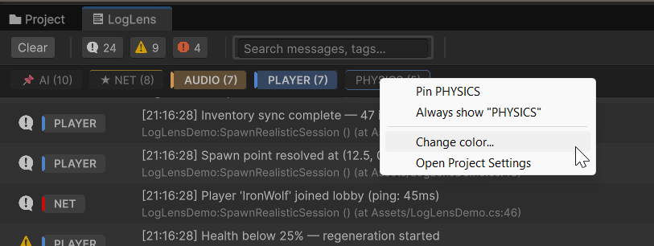
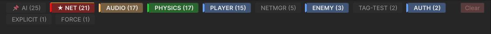

# Tag System

Tags turn a wall of text into an organised, filterable stream. Every log entry can carry a tag — a short label like `NET`, `AUDIO`, `AI`, or `PLAYER` — that appears as a colored chip in the tag bar and a badge on each row.

Click a chip. Instantly see only the logs that matter.



---

## How Tags Are Resolved

LogLens resolves tags automatically using a priority system. The first source that matches wins — you don't need to configure anything for basic use.

| Priority | Source | How It Works | Example |
|---|---|---|---|
| **1** | Explicit parameter | Pass a tag string directly to `LogLens.Log` | `LogLens.Log("msg", "NET")` |
| **2** | `[TAG]` bracket prefix | LogLens scans the message for a leading `[TAG]` pattern | `Debug.Log("[NET] timeout")` |
| **3** | Compiler message | C# compiler errors/warnings auto-tagged `COMPILER` | `Assets/Foo.cs(12,5): error CS1002` |
| **4** | User regex rules | Custom patterns defined in Project Settings extract tags from messages | `AudioMgr: clip loaded` -> `AUDIOMGR` |
| **5** | `[LensLogTag]` attribute | Class-level attribute resolved when using `LogLens.Log<T>()` | `[LensLogTag("NET")] class NetworkManager` |
| **6** | Untagged | No tag found — entry displays without a tag badge | Any unmatched log |

**Key rule:** Message content (priorities 1-4) always overrides class-level attribution (priority 5). If your message says `[AUTH]` and the class has `[LensLogTag("NET")]`, the tag is `AUTH`.

---

## 1. Bracket Prefix — Zero Code Changes

The fastest way to tag logs. Add `[TAG]` to the start of any log message — works with plain `Debug.Log`, no LogLens API required.

```csharp
Debug.Log("[NET] Socket connected");
Debug.LogWarning("[AUDIO] Clip not found: footsteps");
Debug.LogError("[AI] Pathfinding failed on NavMesh");
```

- Fast character-based detection — no regex overhead
- Tags are stored uppercase (`[net]` becomes `NET`)
- Tag must be 2-32 characters, alphanumeric plus `_`, `-`, `:`
- Works with every Unity log method

**Rich text support:** Messages wrapped in Unity rich text like `<color=red>[TAG] message</color>` are handled correctly — LogLens strips leading rich text tags before scanning for the `[TAG]` bracket.

**This is the recommended approach for most projects.** Your existing `Debug.Log` calls become tagged the moment you add the prefix.

---

## 2. `[LensLogTag]` Attribute — Class-Level Tags

When every log from a class should carry the same tag, apply the attribute once and use the generic `LogLens.Log<T>()` overload:

```csharp
[LensLogTag("NET")]
public class NetworkManager : MonoBehaviour
{
    void OnConnect()
    {
        LogLens.Log<NetworkManager>("Connected");           // tag: NET
        LogLens.Log<NetworkManager>("Handshake complete");  // tag: NET
    }

    void OnAuthFail(string reason)
    {
        // Override at the call site when needed
        LogLens.Error<NetworkManager>(reason, "AUTH");      // tag: AUTH (explicit wins)
    }
}
```

**Inheritance works.** Subclasses inherit the attribute from the base class:

```csharp
[LensLogTag("ENEMY")]
public class EnemyBase : MonoBehaviour { }

public class Goblin : EnemyBase { }    // LogLens.Log<Goblin>("hit") -> tag: ENEMY
public class Dragon : EnemyBase { }    // LogLens.Log<Dragon>("roar") -> tag: ENEMY
```

> **Note:** `[LensLogTag]` only applies to `LogLens.Log<T>()`, `Warning<T>()`, and `Error<T>()` — not to `Debug.Log()`.

---

## 3. Explicit Tag Parameter

Override any automatic resolution by passing the tag directly:

```csharp
LogLens.Log("Connection established", "NET");
LogLens.Warning("Token expired", "AUTH");
LogLens.Error("Timeout after 30s", "NET");
```

This is highest priority — always wins, regardless of bracket prefixes or attributes.

---

## 4. User Regex Rules

For custom message formats that don't use `[TAG]` brackets, define extraction rules in **Project Settings > LogLens > Tags > Tag Deduction**.


| Pattern | Example Message | Extracted Tag |
|---|---|---|
| `^(\w+):\s` | `AudioManager: clip loaded` | `AUDIOMANAGER` |
| `^##\s*(\w+)` | `## Physics overlap detected` | `PHYSICS` |

- Rules run in list order — first match wins
- Use **capture group 1** for dynamic extraction, or set a **Fixed Tag** for a constant
- **Test button** per rule lets you try a sample message inline
- Rules are evaluated after the built-in bracket and compiler checks (priority 4)
- When rich text rendering is enabled, rich text tags are stripped from the message before regex matching

---

## 5. COMPILER Tag (Reserved)

C# compiler errors and warnings are automatically tagged `COMPILER`. This applies to messages matching the standard compiler output format: `path.cs(line,col): error/warning CS/IDE/CA...`

**Special behaviour:**

- **Survives Clear** — COMPILER entries are kept when you clear the log. They are only removed when the next compilation succeeds.
- **Jump to source** — Double-click a COMPILER entry to jump to the file and line referenced in the error.
- **Distinctive styling** — Amber/yellow badge with a full border, making compiler issues easy to spot.
- **Disable** — Toggle off in Project Settings > LogLens > Logs > Compiler Tag Enabled.

---

## Tag Bar Actions

Right-click any tag chip for quick actions:

| Action | Effect |
|---|---|
| **Pin / Unpin** | Pinned tags stick to the left of the tag bar |
| **Always Show** | Tag bypasses the tag filter — entries with this tag are always visible. Level toggles still apply. Managed in Project Settings. |
| **Change Color...** | Opens a color picker for this tag |
| **Open Project Settings** | Jumps to LogLens settings |

---

## Always-Visible Tags

Some logs should never be filtered out. In **Project Settings > LogLens > Tags > Always-Visible Tags**, add tags that should always pass through the tag filter.

Use this for system-critical tags — crash reporters, analytics, anti-cheat — that you need to see regardless of which filter state you're in. Level toggles still apply.

---

## Tag Colors

Assign colors to tags in **Project Settings > LogLens > Tags > Tag Colors**. Colors appear:

- On the tag chip in the tag bar
- On the tag badge in each log row
- In grouped view headers

Right-click a chip and choose **Change Color...** for quick edits without leaving the Editor window.



---

## Tips

- **Start simple.** `[TAG]` prefixes in `Debug.Log` get you 90% of the value with zero new API.
- **Use attributes for consistency.** When a class always logs under one tag, `[LensLogTag]` eliminates repetition.
- **Override when needed.** The explicit parameter (priority 1) lets you break out of class-level tagging for special cases.
- **Don't over-tag.** 5-15 tags is the sweet spot for most projects. Too many tags is just as noisy as none.
